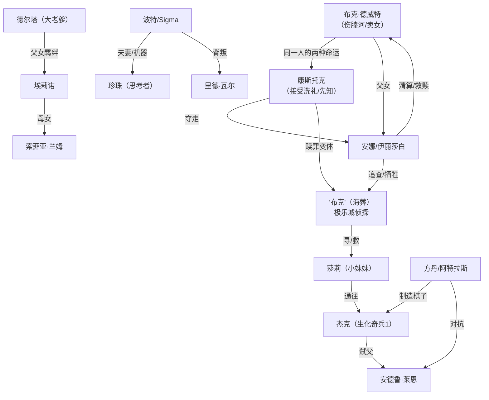

# 07 · 角色档案

> 本篇按作品整理主要角色。档案字段：身份、立场、关键剧情、结局/命运。跨作品角色会标注其出现作品。

---

## 一、《生化奇兵1》（1960）

### 杰克（Jack）
- **身份**：初代主角。客机失事唯一生还者。
- **立场**：棋子 → 觉醒的"人"。
- **关键剧情**：被方丹用莱恩基因秘密培育的改造人，自幼植入"Would you kindly"精神控制指令；空难亦是方丹策划。全程被引导杀死莱恩，在特南鲍姆帮助下挣脱控制，击败方丹。
- **结局**：随玩家选择（拯救/收割小妹妹）成为"父亲"、极乐城之主或暴君（详见 [`08`](08-结局与主题解析.md)）。

### 安德鲁·莱恩（Andrew Ryan）
- **身份**：极乐城缔造者，莱恩工业总裁。
- **立场**：客观主义/极端个人主义。
- **关键剧情**：建造极乐城；与方丹明争暗斗；内战后期众叛亲离；被杰克以高尔夫球杆击杀。
- **名言**："一个人做选择，奴隶服从命令。"
- **相关**：详见 [`02`](02-生化奇兵1.md)│ 理念解析见 [`00`](00-背景设定与世界观.md)

### 弗兰克·方丹 / 阿特拉斯（Frank Fontaine / Atlas）
- **身份**：走私起家的基因巨头；伪造死亡后化名"阿特拉斯"潜伏。
- **立场**：伪善、唯利是图。
- **关键剧情**：培育杰克作为弑莱恩武器；全作以"救命恩人"伪装引导杰克；揭露后注射海量 ADAM 变异，最终败亡。
- **相关**：详见 [`02`](02-生化奇兵1.md)

### 布里吉特·特南鲍姆（Brigid Tenenbaum）
- **身份**：科学家，ADAM/海蛞蝓培育法的发现者，"小妹妹体系"的缔造者。
- **立场**：从造孽者到赎罪者。
- **关键剧情**：创建小妹妹体系后良心发现，转而帮助杰克；为杰克解除方丹的精神控制；引导杰克拯救小妹妹。
- **相关**：详见 [`02`](02-生化奇兵1.md)

### 桑德·科恩（Sander Cohen）
- **身份**：极乐城艺术家，强韧堡垒的主人。
- **立场**：艺术至上的疯子。
- **关键剧情**：以"杰作"之名强迫杰克杀死三名堕落艺术家"缪斯"；留下诡异艺术遗产。
- **相关**：详见 [`02`](02-生化奇兵1.md)

### 斯坦曼医生（Dr. J. S. Steinman）
- **身份**：医疗站外科医生。
- **立场**：审美狂热/完美主义疯魔。
- **关键剧情**：以"美学手术"名义残害患者，被杰克击败。
- **相关**：详见 [`02`](02-生化奇兵1.md)

---

## 二、《生化奇兵2》（1968）

### 德尔塔（Subject Delta）
- **身份**：阿尔法系列大老爹原型，本作主角。
- **立场**：被改造的工具 → 觉醒的父亲。
- **关键剧情**：1958 年为守护埃莉诺而死，1968 年被埃莉诺以心灵羁绊唤醒；穿越极乐城救女，对抗索菲亚·兰姆；结局选择牺牲或控制（详见 [`08`](08-结局与主题解析.md)）。
- **相关**：详见 [`03`](03-生化奇兵2.md)

### 埃莉诺·兰姆（Eleanor Lamb）
- **身份**：索菲亚·兰姆之女，德尔塔守护过的小妹妹。
- **立场**：被母亲当作"完美继承人"的棋子 → 觉醒的女儿。
- **关键剧情**：唤醒德尔塔并引导他拯救自己；最终在德尔塔与母亲之间做出抉择，决定极乐城小妹妹们的命运。
- **相关**：详见 [`03`](03-生化奇兵2.md)

### 索菲亚·兰姆（Sofia Lamb）
- **身份**：精神科医生，"家庭（The Family）"集体主义公社领袖。
- **立场**：极端利他/集体主义（与莱恩针锋相对）。
- **关键剧情**：被莱恩囚于珀尔塞福涅，内战期间掌权；欲将埃莉诺改造成"完美者"；最终结局随玩家选择（被处决或被带走）。
- **相关**：详见 [`03`](03-生化奇兵2.md)

### 奥古斯都·辛克莱尔（Augustus Sinclair）
- **身份**：极乐城商人，德尔塔的"供货商"向导。
- **立场**：利益至上的亦敌亦友。
- **关键剧情**：一路出售装备引导德尔塔；终局被兰姆改造成大老爹，德尔塔被迫将其击杀。
- **相关**：详见 [`03`](03-生化奇兵2.md)

### 格蕾丝·霍洛韦 / 斯坦利·普尔 / 亚历山大博士
- **格蕾丝（Grace Holloway）**：贫民区歌手，"家庭"前成员，可杀/可饶。
- **斯坦利·普尔（Stanley Poole）**：背弃莱恩的懦弱幸存者，可杀/可饶。
- **亚历山大博士（Dr. Gilbert Alexander）**：大老爹体系缔造者，被改造成"亚历山大大帝"怪物，可杀（怜悯）或无视。
- **相关**：详见 [`03`](03-生化奇兵2.md)

---

## 三、《密涅瓦之巢》（1968）

### 查尔斯·米尔顿·波特 / 实验体 Sigma（Charles Milton Porter / Subject Sigma）
- **身份**：思考者缔造者；被改造成大老爹原型 Sigma 的本作主角。
- **立场**：守护爱情的记忆者。
- **关键剧情**：将亡妻珍珠的意识上传进思考者；被搭档瓦尔背叛、抹除记忆并改造；夺回思考者后与珍珠重逢。
- **相关**：详见 [`04`](04-密涅瓦之巢.md)

### 里德·瓦尔（Reed Wahl）
- **身份**：波特的前搭档，思考者共同缔造者。
- **立场**：野心家。
- **关键剧情**：背叛波特，妄图独占思考者；最终被 Sigma 击败。
- **相关**：详见 [`04`](04-密涅瓦之巢.md)

### 珍珠（Pearl）
- **身份**：波特亡妻，意识存于思考者。
- **关键剧情**：以"机器中的灵魂"身份在终局与波特重逢。
- **相关**：详见 [`04`](04-密涅瓦之巢.md)

---

## 四、《生化奇兵：无限》（1912）

### 布克·德威特（Booker DeWitt）
- **身份**：前美国骑兵、前平克顿侦探、赌博成性的私家侦探；本作主角。
- **立场**：赎罪者。
- **关键剧情**：参与伤膝河屠杀后沉沦；卖女还债（安娜）；被卢特斯送往哥伦比亚"救回女儿"；终局揭示他就是康斯托克的另一面，被伊丽莎白们"淹死"于洗礼。
- **相关**：详见 [`05`](05-生化奇兵-无限.md)

### 伊丽莎白 / 安娜·德威特（Elizabeth / Anna DeWitt）
- **身份**：布克之女，天生撕裂能力者；本作女主。
- **立场**：被囚的天才 → 觉醒的"神"。
- **关键剧情**：自幼被康斯托克夺走并囚于高塔；随布克逃亡成长；终局亲手"清算"父亲布克；《海葬》中完成救赎闭环（详见 [`06`](06-海葬系列.md)）。
- **相关**：详见 [`05`](05-生化奇兵-无限.md)

### 扎卡里·康斯托克（Zachary Comstock）
- **身份**：哥伦比亚"先知"；**接受洗礼的布克**。
- **立场**：宗教狂热、美国至上的独裁者。
- **关键剧情**：建立哥伦比亚；抢走安娜；因暴露于撕裂加速衰老；在《无限》结局与《海葬》第 1 章中分别迎来两种终结。
- **相关**：详见 [`05`](05-生化奇兵-无限.md)│ [`06`](06-海葬系列.md)

### 罗伯特 & 罗莎琳德·卢特斯（Robert & Rosalind Lutece）
- **身份**：物理学家；跨世界线的"男女同位体"。
- **立场**：跨越量子之境的旁观者/赎罪者。
- **关键剧情**：发明撕裂技术；助康斯托克夺安娜后懊悔，操纵布克踏上赎罪之旅；以"既生又死"的量子态存在。
- **相关**：详见 [`05`](05-生化奇兵-无限.md)

### 黛西·菲茨罗伊（Daisy Fitzroy）
- **身份**：Vox Populi 领袖。
- **立场**：底层反抗者 → 暴力革命者。
- **关键剧情**：组织武装起义；因要杀害康斯托克的养子而被布克击毙。
- **相关**：详见 [`05`](05-生化奇兵-无限.md)

### 杰里迈亚·芬克（Jeremiah Fink）
- **身份**：芬克工业老板，哥伦比亚军工巨头。
- **立场**：投机资本家。
- **关键剧情**：从撕裂中窃取极乐城技术制造 vigor 与鸣禽；与康斯托克相互利用。
- **相关**：详见 [`05`](05-生化奇兵-无限.md)

### 鸣禽（Songbird）
- **身份**：看守伊丽莎白的机械-生物混合巨兽。
- **立场**：被制造的爱/执念。
- **关键剧情**：自幼看守伊丽莎白；终局为保护她自我牺牲。
- **相关**：详见 [`05`](05-生化奇兵-无限.md)

### 斯莱特（Slate）
- **身份**：伤膝河老兵，英雄殿堂守将。
- **立场**：崇拜并怨恨布克的旧识。
- **关键剧情**：试探布克后战死，推动"布克非普通人"的伏笔。
- **相关**：详见 [`05`](05-生化奇兵-无限.md)

---

## 五、《海葬》（1958–1959）

### 伊丽莎白（海葬版）
- **身份**：《无限》结局后的伊丽莎白变体。
- **立场**：赎罪者 → 牺牲者。
- **关键剧情**：为追查逃逸的康斯托克与救助莎莉进入极乐城；第 2 章为救莎莉牺牲，完成"债务已偿"。
- **相关**：详见 [`06`](06-海葬系列.md)

### "布克"（海葬版）/ 康斯托克
- **身份**：被卢特斯洗去记忆、自以为布克的康斯托克变体，极乐城私家侦探。
- **关键剧情**：受伊丽莎白委托寻莎莉；终局被揭穿身份，随坠机走向终点。
- **相关**：详见 [`06`](06-海葬系列.md)

### 莎莉（Sally）
- **身份**：极乐城小女孩；第 2 章中沦为小妹妹。
- **立场**：无辜的孩子/伊丽莎白救赎的对象。
- **关键剧情**：第 1 章被追查；第 2 章被伊丽莎白以生命救出，通往《生化奇兵1》的小妹妹世界。
- **相关**：详见 [`06`](06-海葬系列.md)

---

## 六、角色关系总览

> 📝 上图仅表示核心人物关系，"撕裂/多元宇宙"意味着每个角色都可能存在多个变体（详见 [`08`](08-结局与主题解析.md)）。
